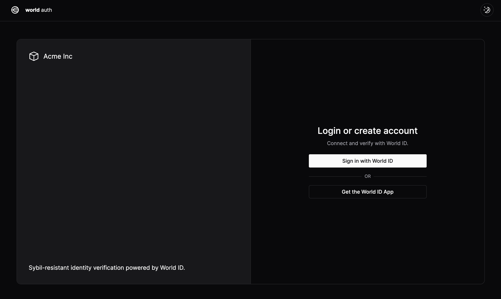

## World ID Authentication with Next.js

To learn more about WorldID click [here](https://docs.worldcoin.org/)



### Running the app

1. Clone the repo and install dependencies

```sh
git clone git@github.com:dabit3/worldid-auth.git

cd worldid-auth

npm install

# or yarn, pnpm, bun, etc...
```

2. Configure environment variables

```sh
# rename .env.local.example to .env.local
AIRSTACK_API_KEY=""
NEXT_PUBLIC_WLD_APP_ID=""
```

3. Run the app

```sh
npm run dev
```